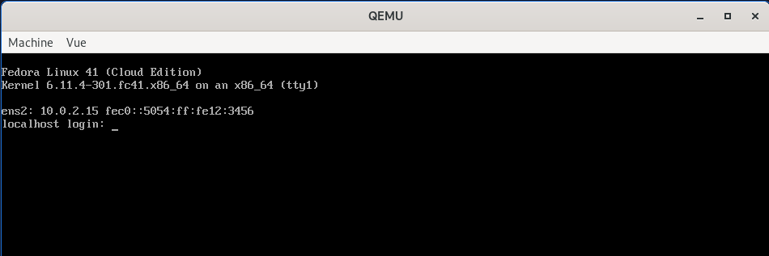
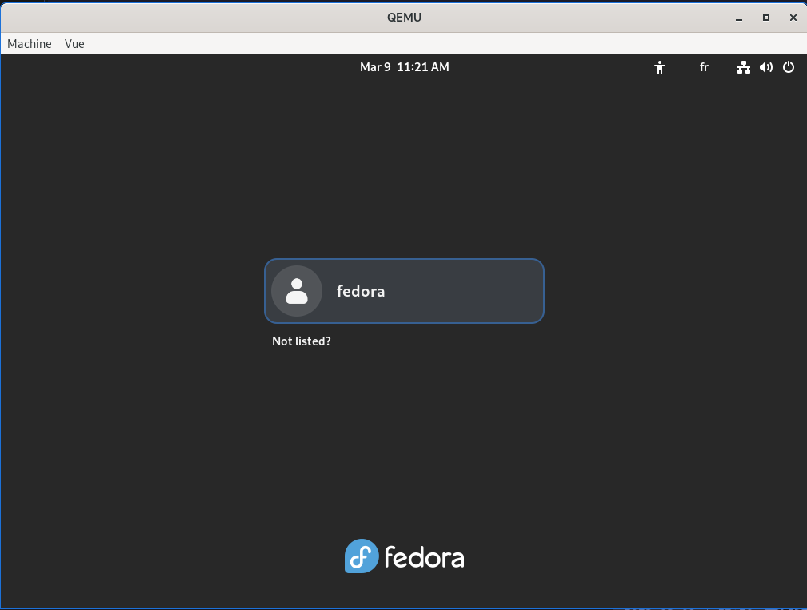

# Qemu Fedora Workstation playground

This playground allows testing the launch of a Fedora Workstation OS - the Desktop version - in [Qemu](https://en.wikipedia.org/wiki/QEMU).
My initial goal with this playground is to be able to automatically test the installation of my workstation with [Chezmoi](https://www.chezmoi.io) in the future.

My second goal with this playground is to explore a minimalist alternative to [Vagrant](https://en.wikipedia.org/wiki/Vagrant_(software)).

This playground is meant to be run and has been tested on Fedora 41.

## Getting started

Install required packages:

```
$ sudo dnf install -y \
    qemu-system-x86 \
    qemu-system-common \
    qemu-img \
    qemu-img-extras \
    cloud-utils \
    mesa-dri-drivers \
    libguestfs-tools
```

> [!TIP]
> From here, you can use `./scripts/up.sh` to execute all commands up to "step 3"

Download Fedora 41 "cloud" version image:

```sh
$ wget https://download.fedoraproject.org/pub/fedora/linux/releases/41/Cloud/x86_64/images/Fedora-Cloud-Base-Generic-41-1.4.x86_64.qcow2 -O fedora-41-base.qcow2
```

Prepare CloudInit file to configure default user password:

```sh
$ cat <<'EOF' > cloud-init.yaml
#cloud-config
users:
  - name: fedora
    plain_text_passwd: password
    lock_passwd: false
    shell: /bin/bash
    sudo: ALL=(ALL) NOPASSWD:ALL
    ssh_authorized_keys:
      - ssh-rsa AAAAB3NzaC1yc2EAAAADAQABAAACAQDEzyNFlEuHIlewK0B8B0uAc9Q3JKjzi7myUMhvtB3JmA2BqHfVHyGimuAajSkaemjvIlWZ3IFddf0UibjOfmQH57/faxcNEino+6uPRjs0pFH8sNKWAaPX1qYqOFhB3m+om0hZDeQCyZ1x1R6m+B0VJHWQ3pxFaxQvL/K+454AmIWB0b87MMHHX0UzUja5D6sHYscHo57rzJI1fc66+AFz4fcRd/z+sUsDlLSIOWfVNuzXuGpKYuG+VW9moiMTUo8gTE9Nam6V2uFwv2w3NaOs/2KL+PpbY662v+iIB2Yyl4EP1JgczShOoZkLatnw823nD1muC8tYODxVq7Xf7pM/NSCf3GPCXtxoOEqxprLapIet0uBSB4oNZhC9h7K/1MEaBGbU+E2J5/5hURYDmYXy6KZWqrK/OEf4raGqx1bsaWcONOfIVXbj3zXTUobsqSkyCkkR3hJbf39JZ8/6ONAJS/3O+wFZknFJYmaRPuaWiLZxRj5/gw01vkNVMrogOIkQtzNDB6fh2q27ghSRkAkM8EVqkW21WkpB7y16Vzva4KSZgQcFcyxUTqG414fP+/V38aCopGpqB6XjnvyRorPHXjm2ViVWbjxmBSQ9aK0+2MeKA9WmHN0QoBMVRPrN6NBa3z20z1kMQ/qlRXiDFOEkuW4C1n2KTVNd6IOGE8AufQ== contact@stephane-klein.info
ssh_pwauth: true
EOF
```

```sh
$ cloud-localds cloud-init.img cloud-init.yaml
```

Creating a differential image - layer - used to work in (this allows us to keep the base image intact while storing all modifications in a separate layer):

```sh
$ qemu-img create -f qcow2 -b fedora-41-base.qcow2 -F qcow2 fedora-working-layer.qcow2
$ ls -s1h *.qcow2
469M fedora-41-base.qcow2
196K fedora-working-layer.qcow2
```

Launch VM with Qemu (step 3):

```sh
$ qemu-system-x86_64 \
    -m 8G \
    -smp 4 \
    -enable-kvm \
    -drive file=fedora-working-layer.qcow2,format=qcow2 \
    -device virtio-vga-gl \
    -display gtk,gl=on \
    -nic user,hostfwd=tcp::2222-:22 \
    -drive file=cloud-init.img,format=raw \
    -fsdev local,id=fsdev0,path=$(pwd)/shared/,security_model=mapped-file \
    -device virtio-9p-pci,fsdev=fsdev0,mount_tag=host_share
```



Access to the VM via ssh (or use `./scripts/enter-in-vm.sh`):

```sh
$ ssh-keygen -R "[localhost]:2222"
$ ssh -o StrictHostKeyChecking=no -p 2222 fedora@localhost
Warning: Permanently added '[localhost]:2222' (ED25519) to the list of known hosts.
[fedora@localhost ~]$
```

A shared folder between the host and the virtual machine is configured, here's how to mount this folder in the VM (or use `./scripts/setup-shared-folder.sh`):

```sh
$ ./scripts/enter-in-vm.sh
# Host [localhost]:2222 found: line 2098
/home/stephane/.ssh/known_hosts updated.
Original contents retained as /home/stephane/.ssh/known_hosts.old
Warning: Permanently added '[localhost]:2222' (ED25519) to the list of known hosts.
Last login: Sun Mar  9 11:31:38 2025
[fedora@localhost ~]$ sudo mkdir -p /mnt/host_share
[fedora@localhost ~]$ sudo mount -t 9p -o trans=virtio,version=9p2000.L host_share /mnt/host_share
[fedora@localhost ~]$ ls /mnt/host_share/ -lha
total 0
drwxr-xr-x. 1 fedora fedora 16 Mar  9 11:44 .
drwxr-xr-x. 1 root   root   20 Mar  9 11:45 ..
-rw-r--r--. 1 fedora fedora  0 Mar  9 11:44 .gitkeep
```

Install packages to set up Fedora Workstation with Gnome Desktop:

```sh
$ ./scripts/install-vm-workstation.sh
```

Result:



> [!TIP]
> You can check the package installation script in the file [`./_payload_install-vm-workstation.sh`](./_payload_install-vm-workstation.sh)

Screencast: https://www.youtube.com/embed/7iuGBhrvMa4?si=WIyY2r1yj-ivSEJN

The hardware acceleration seems to be working correctly.
